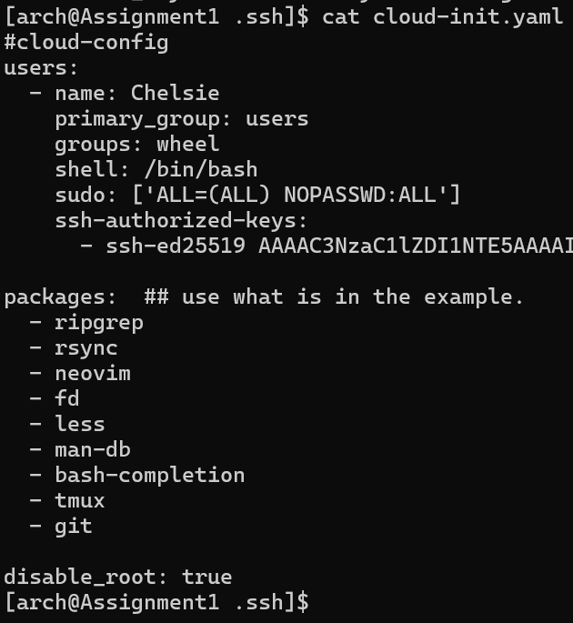

# Linux-Ass1
First Assignment ACIT 2420

# ACIT 2420 ASSIGNMENT I  
# Chelsie Salome Lele Wambo  
# A01372274  

# CREATING A REMOTE SERVER WITH DigitalOcean  

Follow this tutorial if you are a CIT Term II student getting started with **DigitalOcean** to :  
- Create SSH keys on your local machine.
- Add a custom Arch Linux image using the web console
- Create a Droplet running Arch Linux using the DigitalOcean web console.
- Use a cloud-init configuration file to automate initial setup tasks (e.g., user creation).
- Connect to your server using your SSH keys.  

# Introduction  
## What are SSH Keys?  
1. What is SSH (Secure Shell) and why is it commonly used for communication between machines?  

2. What are the benefits of SSH Keys  
3. Why is SSH key-based authentication preferred to password-based authentication  

# Prerequisites  
What you will need:  
* A Linux, macOS, or Windows machine (with Git Bash or PowerShell installed for Windows users).  
* Basic familiarity with the command line. Here are some basic command lines for different OS:
    * [Windows Command Lines](https://learn.microsoft.com/en-us/windows-server/administration/windows-commands/windows-commands#c)  
    * [Mac Command Lines](https://developer.apple.com/library/archive/documentation/OpenSource/Conceptual/ShellScripting/CommandLInePrimer/CommandLine.html)  
    * [Linux Command Lines](https://ubuntu.com/tutorials/command-line-for-beginners#2-a-brief-history-lesson)  

# Section I - Creating SSH  Keys on your Local Machine  
## Overview  
..... This section will ....

## Step 1: Understanding SSH Key Pairs  
### Private Key  
### Public Key  
### Private Key vs Public Key  

## Step 2: Installing OpenSSH  
OpenSSH is ...
* Check if SSH is installed  
If you have the following versions of OS or newer, then your machine most-likely already have OpenSSH installed:  
    * Windows 10 or Windows 11  
    * macOS 10.13  
    * Most Linux Distros  

## Step 3: Generating an SSH Key Pair  
* ### Windows Users  
> **Note:** The commands below must be typed in the **Windows Terminal**, NOT in the **Windows Powershell**
1. Create an .ssh directory (if not yet created) using the command:
> `mkdir .ssh`  
2. Create the ssh key pair using the command:
>`ssh-keygen -t ed25519 -f C:\Users\your-user-name\.ssh\key-name -C "youremail@email.com"`  

**Explanation of the command:**  
* `ssh-keygen`: Command-line utility used to generate, manage and convert SSH keys.  
* `-t`: specifies the **type of key** to generate.  
* `ed25519`: is a type of public-key algorithm. Other options of public key types include: rsa, dsa & ecdsa. Ed25519 is preferred for new keys due to its superior performance, smaller key sizes, better security, and resistance to certain attacks. (VulnerX, 2024) You can refer to [RSA vs ECDSA vs Ed25519](https://vulnerx.com/ssh-key-algorithms/) for further reading about each public key advantages.  
* `f`: option specifies the file name and path where the key pair (both the private and public key) will be saved.  
* `C:\Users\your-user-name\.ssh\key-name`: is the full path on a Windows system where the key files will be stored, please replace `your-user-name` with the actual **user name** as displayed on the terminal, and `key-name` with the **key name** that you would have chosen for your key:
        * The private key will be saved as `key-name`.  
        * The public key will be saved as `key-name.pub`.  
* `C`: option adds a comment to the key.  
    * `"youremail@email.com"`: is the comment added to the key. This comment is embedded in the public key file and is visible when the key is used. It's helpful for recognizing which key belongs to whom, especially when managing multiple keys on servers or services like GitHub.  
    * **Example**: Let's say your username is Chelsie, your email address is "chelsie@gmail.com"  and you choose to name your key "git-key", then the command to create your SSH key pair might look like this:
    > `ssh-keygen -t ed25519 -f C:\Users\Chelsie\.ssh\git-key -C "chelsie@gmail.com"`  

### macOS & Linux Users  
You don't have to manually create an .ssh directory as running the `ssh-keygen` command will automatically do that.  
* Open your terminal and type:  
> `ssh-keygen -t ed25519 -f ~/.ssh/key-name -C "youremail@email.com"`  
**Explanation of the Command:** 
* The command is similar to the Windows-command, the only difference is the path.  
* `-f ~/.ssh/key-name`: This tells ssh-keygen where to save the generated private key. It will create the .ssh directory if it does not already exist and place key-name and key-name.pub (the private and public keys, respectively) inside it. (macOS & Linux use the tilde ~ to represent the user's home directory).  

## Step 4: Choosing a Passphrase  
You can protect the private using a **passphrase**. A **passphrase** is ............  
Because we are just using this for a small project, and to simplify your life ie to not have to remember about passphrases, I just to not set a passphrase and just hit **ENTER** twice.............  

## Step 5: Verifying your SSH Keys  
Type `cd .ssh` and next `ls` to view the files in the .ssh directory.  
> The keys are successfully created if you see the following files in the .ssh directory:  
* **key-name** *(private key)*  
* **key-name.pub** *(public key)*  

# Section II - Creating a Droplet running Arch Linux using the `doctl` Command-Line Tool  

## Overview  
*Explain that this section will guide users through creating a Droplet running Arch Linux using the doctl command-line tool.*
*Briefly mention that doctl is DigitalOcean’s command-line interface for managing Droplets and other resources.*  

## Step 1: Installing and Configuring `doctl`.  
### a. Installing `doctl`:  
1. Update your Arch Linux system by running `sudo pacman -Syu`.
>**Breakdown of the Command** 
*  `sudo`: This allows you to run the command with elevated (superuser) privileges since we are performing System updates.

* `pacman`: This is the package manager for Arch Linux and its derivatives. It handles the installation, updating, and removal of software packages.

*  `Syu`:
    * `-S` (Sync): This option tells pacman to download the package(or upgrade it if it's already installed) and install any required software for the package to function properly.
    * `-y` (Refresh): This option forces pacman to download the most up-to-date package from the Arch repositories.
    `-u` (Upgrade): This option upgrades all installed packages on your system to the latest versions available in the repositories.
2. Run `sudo pacman -S doctl` to install **doctl** on your local machine.
>**Breakdown of the Command**
* `sudo`, `pacman` & `-S` have the same functions here as what was explained above.
* `doctl`: is the name of the package we want to install.

To check it **doctl** was successfully installed, you can run `doctl version` and ensure you get a similar output to the one on the picture:
 

## b. Creating an API Token 
An **API Token** serves as a means of **authentication** and **authorization** when creatind a droplet using DigitalOcean's CLI tool **doctl**. Here are some of the functions of the **API Token**:
* **Authentication**: by acting like a password to verify your identity.
* **Authorization**: by granting permission to execute commands on your DigitalOcean account (droplet creation & management etc.)
* **Secure Access**: By allowing you to safely access your DigitalOcean account without needing to input your username and password every time.
Follow the steps below to generate an **API Token**:
1. log into your DigitalOcean Account (if not logged in yet)
2. Scroll down the **Side bar** and click **API**. (As shown on the picture)
 

3. On the **Tokens** tab, click **Generate New Token**.  
4. Type the *<Token Name>* and select **Full Access** to grant the token full permissions > Click **Generate Token**.You can leave the default **Expiration** choice.(As shown on the picture)

5. Click **Copy** to copy the personal token and save it somewhere for the next step as it will be only be generated once.

### c. Using the API token to grant account access to doctl 
1. Run `doctl auth init --context Token1` to initialize the authentication for `doctl`.
> **Breakdown of the command**
* `doctl`: DigitalOcean's CLI(command line tool)
* `auth`: subcommand for authentication
* `init`: keyword to initialize the authentication process
* `--context`: to specify a name for this authentication context.
* `Token1`:is the name of the context we are setting up, you can name it however you want, although it is advised to choose a descriptive name. By specifying a context name, we can easily switch between different sets of credentials or configurations later on. The next picture shows what your screen should look like.

> 
2. Enter the **API Token** previously generated as prompted and press **ENTER**.

### d. Validating that doctl is working properly.
Run `doctl account get`. You should get an output similar to the one on the picture below, indicating that `doctl` now has full access to your DigitalOcean account.

### e. Adding your ssh-key to DigitalOcean using `doctl`
Run 

## Step 2:  Setting Up the Arch Linux Droplet  

### Part 1: Creating a Cloud-config File using `doctl` & Cloud-init
**What is Cloud-init?** 

**What are thr benefits of a cloud-config file?** 

**How to create a cloud-config file?** 

2. Install Neovim on your local machine with the command `sudo pacman -S neovim`
>**Breakdown of the command** 
* `-S`: This option stands for "sync" and is used to install a package from the official Arch repositories. It will download the required package along with its dependencies and install them.

* `neovim`: This is the name of the package you're installing. In this case, it's the Neovim text editor

**neovim** is sucessfully installed if when running  `nvim version`the output on the screen looks like this: 

3. Run `cd .ssh` to move to the **.ssh** directory.
4. Run `nvim cloud-config.yaml` to create and open the file named **cloud-config.yaml** in **Normal mode**.
5. Press the key **I** on your keyboard to switch to **Insert Mode**.
6. . *copy* & *paste* the following configuration: 
>#cloud-config
>users:
>	- name: Chelsie
>    primary_group: users
>    groups: wheel
>    shell: /bin/bash
    sudo: ['ALL=(ALL) NOPASSWD:ALL']
    ssh-authorized-keys:
      - ssh-ed25519 AAAAC3NzaC1lZDI1NTE5AAAAIIg/IZG9QVEtwbjoO39uE3tmeFKER1cSRPVe4vodU9cY bcspies123@gmail.com

packages:  ## use what is in the example.
  - ripgrep
  - rsync
  - neovim
  - fd
  - less
  - man-db
  - bash-completion
  - tmux
  - git

disable_root: true

**Command Breakdown ...............**

7. Make the following changes:
    * name: <*name_of_user*> ..........
    * primary_group = <*group_name*>........
    * ssh-authorized-keys = <*content_of_the_public_key*> previously created...........
    * Add/remove packages. ...........
8. Press the **ESC** key on your keyaboard to exit the **Insert Mode** 
9. Type **:wq** and press **ENTER** to save the changes and exit out of neovim.
You can confirm the **cloud-config.yaml** file has been created by running `cat cloud-config.yaml`. This will display the content of the file as such: 

### Part 2: Creating the Droplet using `doctl`
To create our droplet using `doctl`, we will need: an **image ID**, an **SSH key ID**, a **region** and a **size** ......*WHY ......?*. You can follow the steps below to gather those information:
* run `doctl compute image list` and copy the **ID** of the Arch Linux image. in this case we will use **165084638**
* Run `doctl compute size list` to view the different processors and RAM sizes you can create your droplet with.
> eg: if you want your droplet to have **one processor** and **1GB of RAM** you can copy (take notes) **s-1vcpu-1gb**.
* Run `doctl compute region list` to view a list of available regions and take notes of your favourite **region ID** or **slug**.
> eg: **sfo3** for San Francisco .....*Why sfo3 ....?*
* Run `doctl compute ssh-key list` to .......

Now that we have those information, you can run: `doctl compute droplet create --image 165084638 --size s-1vcpu-1gb --region sfo3 --ssh-keys 43507363 --user-data-file ~/.ssh/cloud-init.yaml --wait wedDroplet` to create the droplet.
> Depending on the packages, it might take up to *? time....*
**Command Breakdown**
*[Exlain what the command does here]........* 

**Explanation of the Command**  

3. Verifying Droplet Creation:  
* Run `doctl compute droplet list` to ensure your droplet is listed as shown on the picture .....

*  Check Droplet Status:  

## Step 3: Accessing the Arch Linux Droplet  
**Connecting via SSH**:  

## Section: Establishing the connection through SSH
### Create a config file

* Run `ssh <droplet name>` to login to the newly create droplet

## Step 4: Post-Setup Configuration  
**Initial System Updates:**

[Environment]::SetEnvironmentVariable("Path", [Environment]::GetEnvironmentVariable("Path", [EnvironmentVariableTarget]::Machine) + ";$env:ProgramFiles\doctl\", [EnvironmentVariableTarget]::Machine)
$env:Path = [System.Environment]::GetEnvironmentVariable("Path","Machine")