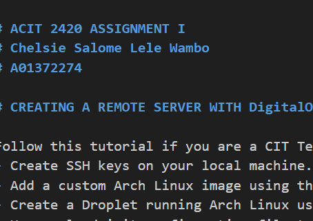

# Linux-Ass1
First Assignment ACIT 2420

# ACIT 2420 ASSIGNMENT I  
# Chelsie Salome Lele Wambo  
# A01372274  

# CREATING A REMOTE SERVER WITH DigitalOcean  

Follow this tutorial if you are a CIT Term II student getting started with **DigitalOcean** to :  
- Create SSH keys on your local machine.
- Add a custom Arch Linux image using the web console
- Create a Droplet running Arch Linux using the DigitalOcean web console.
- Use a cloud-init configuration file to automate initial setup tasks (e.g., user creation).
- Connect to your server using your SSH keys.  

 