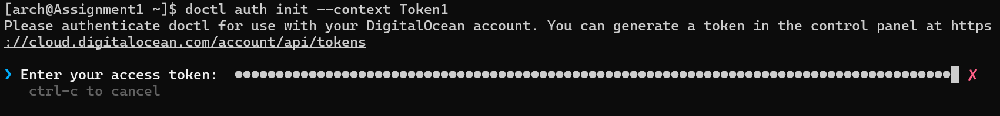

# ACIT 2420 ASSIGNMENT I  
## Chelsie Salome Lele Wambo  - A01372274  
## Instructor: Nathan McNinch

# Content Structure
## Introduction
>### What is SSH and what are SSH-keys?
>### What is Cloud-init and why use it?
>### Intended Audience
>### Assumptions
## I - Technical Requirements
>### Software
>### Hardware
## II- Section 1: Creating SSH  Keys on your Local Machine
## III- Section 2 - Creating a Droplet running Arch Linux using the `doctl` Command-Line Tool
## IV- Section 3: Accessing the Arch Linux Droplet via SSH 
## V- Glossary
## VI- Troubleshooting Guide
## Rerences

# Introduction
## What is SSH?
SSH (Secure Shell) is a cryptographic network protocol that enables secure communication between two machines over an unsecured network. SSH introduced SSH keys, which are a more secure authentication method than passwprds. It is widely used by system administrators, developers, and anyone needing remote access to servers. 

## What are the Benefits of using ssh-key  Authentication over Password-based Authentication?
SSH key-based authentication is preferred over passwords because it uses a pair of cryptographic keys—a public and private key—offering stronger security and resistance to brute-force attacks, phishing, and theft. This method provides a more secure and efficient way to authenticate without needing to manage passwords frequently, making it the superior choice for securing server access. 

## What is Cloud-init and why use it?
Cloud-Init is a tool that automates the initial setup and configuration of cloud servers, such as DigitalOcean Droplets. It runs during the first boot of a new instance, executing predefined tasks like setting up users, installing packages, and configuring network settings. Cloud-Init uses configuration files (like cloud-config) to define these tasks, simplifying the deployment of servers.
Here are some of its benefits:
* **Automated Configuration**:
When creating a DigitalOcean Droplet, Cloud-Init automates critical tasks, such as installing necessary software, creating users, and configuring SSH keys, all without manual intervention.

* **Efficient Use of SSH Keys**:
Cloud-Init simplifies the process of adding SSH keys to a Droplet by automatically installing public keys into the authorized_keys file, ensuring secure, passwordless login from the start.

* **Consistency Across Deployments**:
Cloud-Init ensures every Droplet is configured consistently, using the same settings and scripts, which is essential when deploying multiple servers or scaling infrastructure.

## Intented Audience
This tutorial for any Information Technology student eager to dive into creating and managing a remote server using DigitalOcean. By the end of this tutorial, you will be able to use the web console or command line (doctl), understand how cloud-init configures Droplets, and connect securely using SSH. You'll also learn how to generate and manage SSH keys for authentication and apply best practices for security in cloud environments.

## Assumptions
This guide assumes that the student:

* Has familiarity with basic Linux commands and navigation within a Linux environment.
* Has experience working in a terminal environment and can use a text editor (like nano or vim) for configuration tasks.
* Has the ability to install software on their local machine, including command-line tools like doctl.
* Has an active DigitalOcean account with sufficient credits to create and manage Droplets.
* Has previously created a Droplet running Arch Linux, implying access to an Arch Linux image.

# I- Technical Requirements
## Hardware
* **Processor**: 1 GHz or faster processor
* **RAM**:For Droplets with less than 3 GB of RAM, a 32-bit operating system is recommended.
A minimum of 1 CPU core is required for basic operations, with more cores needed for resource-intensive applications.
* **PC/Laptop**: A device capable of running a terminal environment and supporting the necessary software tools.
* **Stable Internet Connection**: Minimum speed of 1 Mbps recommended for optimal performance during configuration and management.

## Software:
* **OS**: Because you already have a DigitalOcean droplet running **Arch Linux**, the commands used will be compatible with a Linux-based terminal. You can refer to the resources below if you have a different Operating System. 
    * [Windows Command Lines](https://learn.microsoft.com/en-us/windows-server/administration/windows-commands/windows-commands#c)  
    * [Mac Command Lines](https://developer.apple.com/library/archive/documentation/OpenSource/Conceptual/ShellScripting/CommandLInePrimer/CommandLine.html)  
    * [Linux Command Lines](https://ubuntu.com/tutorials/command-line-for-beginners#2-a-brief-history-lesson) 

>**Note**: We will be refering to your existing droplet running Arch Linux as ***Local Machine**.
* **Web Browser**: Google Chrome or any Web Browser (latest version).

# II- Section 1 - Creating SSH  Keys on your Local Machine  
## Overview  
..... This section will ....

## Step 1: Understanding SSH Key Pairs  
### Private Key  
### Public Key  
### Private Key vs Public Key  

## Step 2: Installing OpenSSH  
OpenSSH is ...
* Check if SSH is installed  
If you have the following versions of OS or newer, then your machine most-likely already have OpenSSH installed:  
    * Windows 10 or Windows 11  
    * macOS 10.13  
    * Most Linux Distros  

## Step 3: Generating an SSH Key Pair  

> **Note:** Since your local machine is a droplet running Arch Linux, the commands we will be running are for Linux-types OS. You can refer to the links provide above if using a differenc OS.

1. Create an .ssh directory (if not yet created) using the command:
> `mkdir .ssh`  
2. Create the ssh key pair using the command:
>`ssh-keygen -t ed25519 -f ~/.ssh/key-name -C "youremail@email.com"`  

**Explanation of the command:**  
* `ssh-keygen`: Command-line utility used to generate, manage and convert SSH keys. 

* `-t`: specifies the **type of key** to generate.  

* `ed25519`: is a type of public-key algorithm. Other options of public key types include: rsa, dsa & ecdsa. Ed25519 is preferred for new keys due to its superior performance, smaller key sizes, better security, and resistance to certain attacks. (VulnerX, 2024) You can refer to [RSA vs ECDSA vs Ed25519](https://vulnerx.com/ssh-key-algorithms/) for further reading about each public key advantages.  

* `f`: option specifies the file name and path where the key pair (both the private and public key) will be saved. 

* `~/.ssh/key-name`: is the full path to the .ssh directory from the current user' home. Please replace `key-name` with the **key name** that you would have chosen for your key:
        * The private key will be saved as `key-name`.  
        * The public key will be saved as `key-name.pub`.  

* `C`: option adds a comment to the key.  
    * `"youremail@email.com"`: is the comment added to the key. This comment is embedded in the public key file and is visible when the key is used.  
    * **Example**: Let's say your username is Chelsie, your email address is "chelsie@gmail.com"  and you choose to name your key **"wedKEY"**, then the command to create your SSH key pair might look like this:
    > `ssh-keygen -t ed25519 -f ~/.ssh/wedKEY -C "chelsie@gmail.com"`  

## Step 4: Choosing a Passphrase  
You can protect the private using a **passphrase**. A **passphrase** is just a string of characters used to add an additional layer of security to your private key through encryption.
To make your life easier and avoid the hassle of remembering a passphrase, you can choose not to set one. To do this, simply hit ENTER twice when prompted for a passphrase. This will create your SSH key without any passphrase protection, allowing you to use it seamlessly for your project. 

## Step 5: Verifying your SSH Keys  
Type `cd .ssh` and next `ls` to view the files in the .ssh directory.  
> The keys are successfully created if you see the following files in the .ssh directory:  
* **key-name** *(private key)*  
* **key-name.pub** *(public key)*  

# III- Section 2 - Creating a Droplet running Arch Linux using the `doctl` Command-Line Tool  

## Overview  
*Explain that this section will guide users through creating a Droplet running Arch Linux using the doctl command-line tool.*
*Briefly mention that doctl is DigitalOcean’s command-line interface for managing Droplets and other resources.*  

## Step 1: Installing and Configuring `doctl`.  
### a. Installing `doctl`:  
1. Update your Arch Linux system by running `sudo pacman -Syu`.
>**Breakdown of the Command** 
*  `sudo`: This allows you to run the command with elevated (superuser) privileges since we are performing System updates.

* `pacman`: This is the package manager for Arch Linux and its derivatives. It handles the installation, updating, and removal of software packages.

*  `Syu`:
    * `-S` (Sync): This option tells pacman to download the package(or upgrade it if it's already installed) and install any required software for the package to function properly.
    * `-y` (Refresh): This option forces pacman to download the most up-to-date package from the Arch repositories.
    `-u` (Upgrade): This option upgrades all installed packages on your system to the latest versions available in the repositories.
2. Run `sudo pacman -S doctl` to install **doctl** on your local machine.
>**Breakdown of the Command**
* `sudo`, `pacman` & `-S` have the same functions here as what was explained above.
* `doctl`: is the name of the package we want to install.

To check it **doctl** was successfully installed, you can run `doctl version` and ensure you get a similar output to the one on the picture:
 

## b. Creating an API Token 
An **API Token** serves as a means of **authentication** and **authorization** when creatind a droplet using DigitalOcean's CLI tool **doctl**. Here are some of the functions of the **API Token**:
* **Authentication**: by acting like a password to verify your identity.
* **Authorization**: by granting permission to execute commands on your DigitalOcean account (droplet creation & management etc.)
* **Secure Access**: By allowing you to safely access your DigitalOcean account without needing to input your username and password every time.
Follow the steps below to generate an **API Token**:
1. log into your DigitalOcean Account (if not logged in yet)
2. Scroll down the **Side bar** and click **API**. (As shown on the picture)
 

3. On the **Tokens** tab, click **Generate New Token**.  
4. Type the *<Token Name>* and select **Full Access** to grant the token full permissions > Click **Generate Token**.You can leave the default **Expiration** choice.(As shown on the picture)

5. Click **Copy** to copy the personal token and save it somewhere for the next step as it will be only be generated once.

### c. Using the API token to grant account access to doctl 
1. Run `doctl auth init --context Token1` to initialize the authentication for `doctl`.
> **Breakdown of the command**
* `doctl`: DigitalOcean's CLI(command line tool)
* `auth`: subcommand for authentication
* `init`: keyword to initialize the authentication process
* `--context`: to specify a name for this authentication context.
* `Token1`:is the name of the context we are setting up, you can name it however you want, although it is advised to choose a descriptive name. By specifying a context name, we can easily switch between different sets of credentials or configurations later on. The next picture shows what your screen should look like.

> 
2. Enter the **API Token** previously generated as prompted and press **ENTER**.

### d. Validating that doctl is working properly.

Run `doctl account get`. You should get an output similar to the one on the picture below, indicating that `doctl` now has full access to your DigitalOcean account.

### e. Adding your ssh-key to DigitalOcean using `doctl`
Run `doctl compute ssh-key import wedKEYY --public-key-file ~/.ssh/wedKEY.pub` to import the key DigitalOcean.
>**Command breakdown**
* `compute`: subcommand to indicate that the operation relates to compute resources, such as Droplets (virtual machines).

* `ssh-key`:to specify that we are working with SSH keys.

* `import`:to import a new SSH public key into your DigitalOcean account.

 * `wedKEY`:the name of the key we created in *Section 1, step #3*.

* `--public-key-file ~/.ssh/wedKEY.pub`: to specify the file path of the SSH public key we want to import. In this case, it points to the public key file named wedKEY.pub located in the .ssh directory of the user's home folder.

## Step 2:  Setting Up the Arch Linux Droplet  

### Part 1: Creating a Cloud-config File using `doctl` & Cloud-init
**What is Cloud-init?** 

**What are thr benefits of a cloud-config file?** 

**How to create a cloud-config file?** 

2. Install Neovim on your local machine with the command `sudo pacman -S neovim`
>**Breakdown of the command** 
* `-S`: This option stands for "sync" and is used to install a package from the official Arch repositories. It will download the required package along with its dependencies and install them.

* `neovim`: This is the name of the package you're installing. In this case, it's the Neovim text editor

**neovim** is sucessfully installed if when running  `nvim version`the output on the screen looks like this: 

3. Run `cd .ssh` to move to the **.ssh** directory.
4. Run `nvim cloud-config.yaml` to create and open the file named **cloud-config.yaml** in **Normal mode**.
5. Press the key **I** on your keyboard to switch to **Insert Mode**.
6.  *copy* & *paste* the following configuration: 
>#cloud-config
>users:
>	- name: Chelsie
>    primary_group: users
>    groups: wheel
>    shell: /bin/bash
>    sudo: ['ALL=(ALL) NOPASSWD:ALL']
>    ssh-authorized-keys:
>      - ssh-ed25519 AAAAC3NzaC1lZDI1NTE5AAAAIIg/IZG9QVEtwbjoO39uE3tmeFKER1cSRPVe4vodU9cY bcspies123@gmail.com

>packages:
>  - ripgrep
>  - rsync
>  - neovim
>  - fd
>  - less
>  - man-db
>  - bash-completion
>  - tmux
>  - git

disable_root: true

**Command Breakdown ...............**

- **users:**: This section defines user accounts to be created on the instance.

- **name: Chelsie** : to pecify the username for the new user account. 

- **primary_group: users**: to assign the user to the users group as the primary group.

- **groups: wheel**: to add the user to the wheel group, which typically allows for administrative privileges (sudo access).

- **shell: /bin/bash**: to sets the default shell for the user to Bash, which is a common command-line shell in Linux.

- **sudo: ['ALL=(ALL) NOPASSWD:ALL']**: to configures the user to have sudo privileges without needing to enter a password for any command. 

- **ssh-authorized-keys:**: to lists SSH public keys that will be authorized for the user.
- **ssh-ed25519 AAAAC3NzaC1lZDI1NTE5AAAAIIg/IZG9QVEtwbjoO39uE3tmeFKER1cSRPVe4vodU9cY bcspies123@gmail.com:** to add a specific SSH public key to the user's account. This is the content of the public key we previously created and paste it there, obtained by running `cat wedKEY.pub`. 

8. Press the **ESC** key on your keyboard to exit the **Insert Mode** 

9. Type **:wq** and press **ENTER** to save the changes and exit out of neovim.

You can confirm the **cloud-config.yaml** file has been created by running `cat cloud-config.yaml`.

### Part 2: Creating the Droplet using `doctl`
To create our droplet using `doctl`, we will need: an **image ID**, an **SSH key ID**, a **region** and a **size** ......*WHY ......?*. You can follow the steps below to gather those information:
* run `doctl compute image list` and copy the **ID** of the Arch Linux image. in this case we will use **165084638**

* Run `doctl compute size list` to view the different processors and RAM sizes you can create your droplet with.
> eg: if you want your droplet to have **one processor** and **1GB of RAM** you can copy (take notes) **s-1vcpu-1gb**.

* Run `doctl compute region list` to view a list of available regions and take notes of your favourite **region ID** or **slug**.

> eg: **sfo3** for San Francisco .....*Why sfo3 ....?*
* Run `doctl compute ssh-key list` to .......

Now that we have those information, you can run: `doctl compute droplet create --image 165084638 --size s-1vcpu-1gb --region sfo3 --ssh-keys 43507363 --user-data-file ~/.ssh/cloud-init.yaml --wait wedDroplet` to create the droplet.
> Depending on the packages, it might take up to *? time....*
**Command Breakdown**
* `droplet create`: to creates a new Droplet (virtual machine).

* `--image 165084638`: to pecifiey the image to use for the Droplet. The number 165084638 represents the unique ID of the custom Arch Linux Image we previously added.

* `--size s-1vcpu-1gb`: to defines the size of the Droplet. The **size s-1vcpu-1gb** means:
    * **1 vCPU**: The virtual CPU count.
    * **1 GB RAM:** The amount of memory (RAM) for the Droplet.
This size is suitable for small applications or testing environments.

* `--region sfo3`: to Specify the region where the Droplet will be created. sfo3 refers to the San Francisco 3 data center. We are choosing this one because it is one of the closest to Vancouver.

* `--user-data-file ~/.ssh/cloud-init.yaml`: to indicate the location of the configuration file (**cloud-init.yaml**) that runs when the Droplet is first initialized. 

* `--wait:` we use this flag to tell doctl to wait until the Droplet creation process is complete before returning control to the terminal, so that we know when the droplet is ready.
* `wedDroplet`: The name of the Droplet being created.

3. Verifying Droplet Creation:  
* Run `doctl compute droplet list` to ensure your droplet is listed as shown on the picture.

## Step 3: Accessing the Arch Linux Droplet  
**Connecting via SSH**: 

# IV- Section 3: Establishing the connection through SSH
### Creating an SSH Config File

Each time you connect to your Droplet, you usually need to specify:
* The IP address or domain of the Droplet.
* The username you’ll use for the connection.
* The path to the private key for authentication.
* The port number (if different from the default).

A configuration file (like the SSH config file) is used to simplify and streamline the process of connecting to a Droplet (or any remote server) by predefining connection settings. So, instead of typing the full command with all connection details every time, a config file allows you to use a short, simple alias.
Follow the steps below to create a **config file**.

1. Run `cd ~/ssh` to move to the **.ssh** directory from the current user home directory.
2. Run `nvim config` to create and open the file named **config** in **Normal mode**.
5. Press the key **I** on your keyboard to switch to **Insert Mode**.
6.  *copy* & *paste* the following configuration: 

>Host wedDroplet
>  HostName 128.199.7.130
>  User Chelsie
>  PreferredAuthentications publickey
>  IdentityFile ~/.ssh/wedKEY
>  StrictHostKeyChecking no
>  UserKnownHostsFile /dev/null

>**Command Breakdown**

* **Host**: This defines a shortcut or alias for the connection. We are choosing "wedDroplet" to refer the droplet we previously created. 

* **HostName 128.199.7.130**: This is the Public IPv4 address of the **wedDroplet** we are connecting to, which in this case is 128.199.7.130. (obtained after running `doctl compute droplet list`).

* **User Chelsie**: to define the username we will use to connect to the Droplet. In this case, it is Chelsie.
>**NOTE**: It must match the username in the **cloud-config.yaml** file.

* **PreferredAuthentications publickey**: to tell SSH to use public key authentication as the preferred method for connecting.

* **IdentityFile ~/.ssh/wedKEY**: to specifie the path to the private key that will be used for authentication. Here, it points to **~/.ssh/wedKEY**, which is the private SSH key we create in **Section 1, step 3** ......

* **StrictHostKeyChecking no**: to disable the verification of the Droplet’s SSH host key.
Normally, SSH checks the host key the first time you connect to a server to ensure you are connecting to the right machine. Setting this to no allows you to bypass the host key verification, which can be useful for automated connections

* **UserKnownHostsFile /dev/null**: to define the file where SSH will save information about the host keys of servers we've connected to.
Setting it to /dev/null because we don’t want to store persistent records of host keys.

* Run `ssh <droplet name>` to login to the newly create droplet

7. Run `exit` to allow the system to save your changes and restart.

8. Run `ssh wedDroplet`. You should be able to see the output as shown on the picture below, indicating a successful connection to your newly created droplet running Arch Linux.

# V- Glossary

## General Troubleshooting Guide
....................................

[Environment]::SetEnvironmentVariable("Path", [Environment]::GetEnvironmentVariable("Path", [EnvironmentVariableTarget]::Machine) + ";$env:ProgramFiles\doctl\", [EnvironmentVariableTarget]::Machine)
$env:Path = [System.Environment]::GetEnvironmentVariable("Path","Machine")